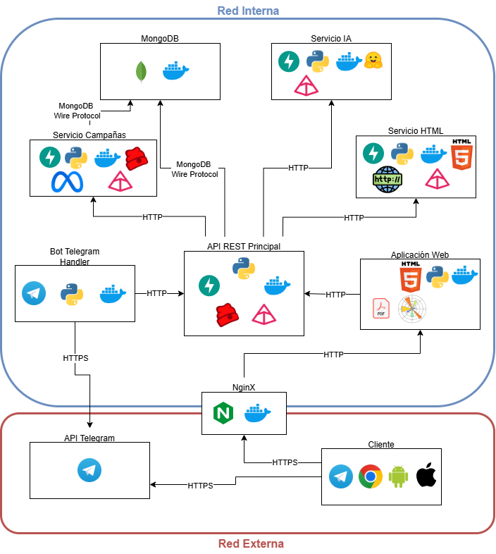

# TFM_CERT_Support_System

## Sobre el CERT Support System
### Resumen
El sistema fue creado con el objetivo de apoyar a equipos técnicos (CERT/CSIRT) en la gestión eficiente del smishing, dado el incremento de este tipo de ataques, su alta rentabilidad para los ciberdelincuentes y la carencia de herramientas especializadas. La motivación principal es automatizar la detección, clasificación y análisis de mensajes de smishing, reduciendo la carga de trabajo humano y facilitando la investigación de campañas fraudulentas.

Entre sus características destacan:

1. Detección automática de mensajes mediante modelos de IA basados en BERT, capaces de realizar clasificación binaria (smishing/no smishing) y categorización en 7 y 13 tipos.

2. Extracción de entidades (NER) para identificar información sensible (bancos, URLs, números de teléfono).

3. Agrupación semántica de campañas mediante FAISS, que permite relacionar mensajes similares.

4. Captura y análisis de HTML de enlaces asociados.

5. Interfaces diferenciadas: una aplicación web para técnicos y otra móvil para ciudadanos/empresas que reportan casos.

La arquitectura está concebida como un sistema integral distribuido en microservicios y contenedorizado con Docker, orquestado a través de una API principal en FastAPI detrás de un proxy inverso Nginx y respaldado por MongoDB como base de datos. Esta arquitectura facilita la escalabilidad, el despliegue independiente de cada componente y la integración modular de nuevos servicios de análisis.

### Componentes
1. API principal        (Docker: api)
2. Base de datos Mongo  (Docker: mongo)
3. Manejador Bot        (Docker: bot)
4. Proxy inverso Nginx  (Docker: nginx)
5. Servicio 1: IA       (Docker: ms1)
6. Servicio 2: HTML     (Docker: ms2)
7. Servicio 3: Campañas (Docker: ms3)

### Arquitectura


## Cómo ejecutar el sistema
En esta sección se explicarán los scripts y comandos para poder lanzar la aplicación. Para poder acceder con TLS/SSL, leer la siguiente sección.

1. **Acceder a la raíz del sistema**
   ```bash
   cd app/nginx
   mkdir -p ssl CA
   ```
2. **Dar permisos de ejecución a los scripts**
   ```bash
   chmod +x launch.sh
   ```
3. **Lanzar aplicación**
    Para lanzar la aplicación en segundo plano ejecutar el script `launch.sh`, y si se desean ver los logs, incluir el parámetro `-logs`:
   ```bash
   ./launch.sh
   ./launch.sh -logs
   ```
4. **Detener aplicación**
    Se podrá hacer mediante el comando de `docker-compose`:
   ```bash
   docker-compose down
   ```
   
## 🔐 Simular TLS

En este proyecto se incluye una simulación de **CA (Certificate Authority)** y **Servidor** para configurar HTTPS en Nginx con certificados firmados por una CA propia.  

### Pasos

1. **Crear directorios**
   ```bash
   cd app/nginx
   mkdir -p ssl CA
   ```

2. **Generar la clave privada de la CA**
   ```bash
   cd CA
   openssl genrsa -des3 -out CA.key 2048
   ```
   > Se pedirá una contraseña. Recuerda guardarla.

3. **Crear el certificado de la CA**
   ```bash
   openssl req -x509 -new -nodes -key CA.key -sha256 -days 1825 -out CA.crt
   ```
   > Pulsa Enter en todos los campos salvo en **Common Name**, donde puedes escribir por ejemplo `autofirmado`.

4. **Generar la clave privada del servidor (sin passphrase)**
   ```bash
   cd ../ssl
   openssl genrsa -out server.key 2048
   ```
   🔹 **Opcional**: si quieres que tenga contraseña deberás generar la clave como a continuación. Además, tendrás que modificar el `nginx.conf`, descomentar la línea con `ssl_password_file` y crear un archivo en /ssl llamado passphrases.txt con la contraseña:
   ```bash
   cd ../ssl
   openssl genrsa -des3 -out server.key 2048
   ```

5. **Generar el CSR (Certificate Signing Request) del servidor**
   ```bash
   openssl req -new -key server.key -out server.csr
   ```
   > Igual que antes, solo completa **Common Name** (`autofirmado`, `localhost` o el dominio/IP que vayas a usar).

6. **Crear archivo de configuración para las extensiones (SAN)**  
   Crea `ssl/configFirma.txt` con este contenido:
   ```ini
   authorityKeyIdentifier=keyid,issuer
   basicConstraints=CA:FALSE
   keyUsage = digitalSignature, nonRepudiation, keyEncipherment, dataEncipherment
   subjectAltName = @alt_names

   [alt_names]
   DNS.1 = 127.0.0.1
   DNS.2 = localhost
   ```
   🔹 **Opcional**: si quieres acceder desde otra máquina de la red, añade tu IP:
   ```ini
   IP.1 = 192.168.1.XXX
   ```

7. **Firmar el CSR con la CA para generar el certificado del servidor**
   ```bash
   openssl x509 -req -in server.csr \
     -CA ../CA/CA.crt -CAkey ../CA/CA.key -CAcreateserial \
     -out server.crt -days 1825 -sha256 -extfile configFirma.txt
   ```

### Resultado esperado

- En `CA/` tendrás:
  - `CA.key` → clave privada de la CA (**secreta, no compartir**).
  - `CA.crt` → certificado público de la CA (hay que instalarlo en los clientes para que confíen).

- En `ssl/` tendrás:
  - `server.key` → clave privada del servidor (solo la usa Nginx).
  - `server.csr` → petición de certificado (se puede borrar tras generar el .crt).
  - `server.crt` → certificado del servidor, firmado por la CA.
  - `configFirma.txt` → archivo con extensiones y SAN.

### Instalar la CA en los clientes

- **Linux (Debian/Ubuntu)**:
  ```bash
  sudo cp CA/CA.crt /usr/local/share/ca-certificates/CA.crt
  sudo update-ca-certificates
  ```

- **Linux (Fedora/RHEL/CentOS)**:
  ```bash
  sudo cp CA/CA.crt /etc/pki/ca-trust/source/anchors/
  sudo update-ca-trust
  ```

- **Firefox**:
  - Ajustes → Privacidad y seguridad → Certificados → Ver certificados → Autoridades → Importar → selecciona `CA.crt`.
  - Marca “Confiar en esta CA para identificar sitios web”.
  - Alternativa: en `about:config` poner `security.enterprise_roots.enabled = true` para que use el almacén del sistema.

### Verificar

- Comprueba que Nginx arranca:
  ```bash
  sudo nginx -t && sudo systemctl reload nginx
  ```

- Test en consola:
  ```bash
  curl -vk https://localhost
  ```

- Test en navegador:
  - Si `CA.crt` está instalado → verás el candado sin errores.
  - Si no lo está → Firefox/Chrome avisarán de certificado no confiable.
